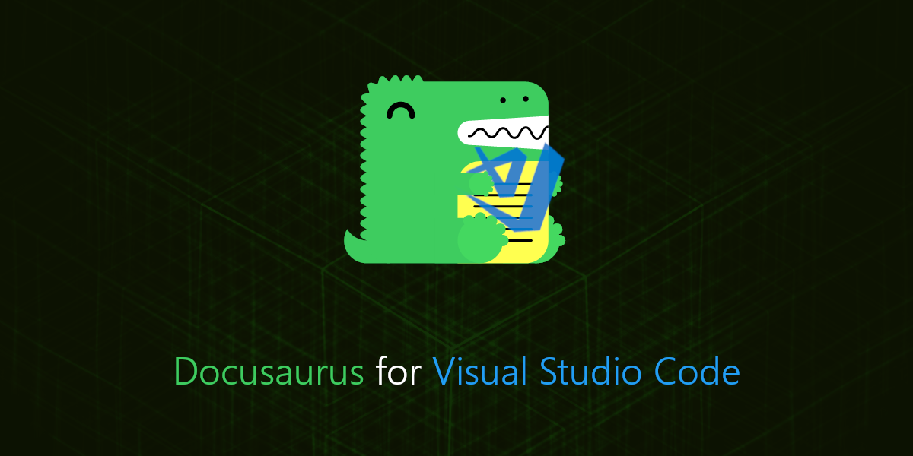
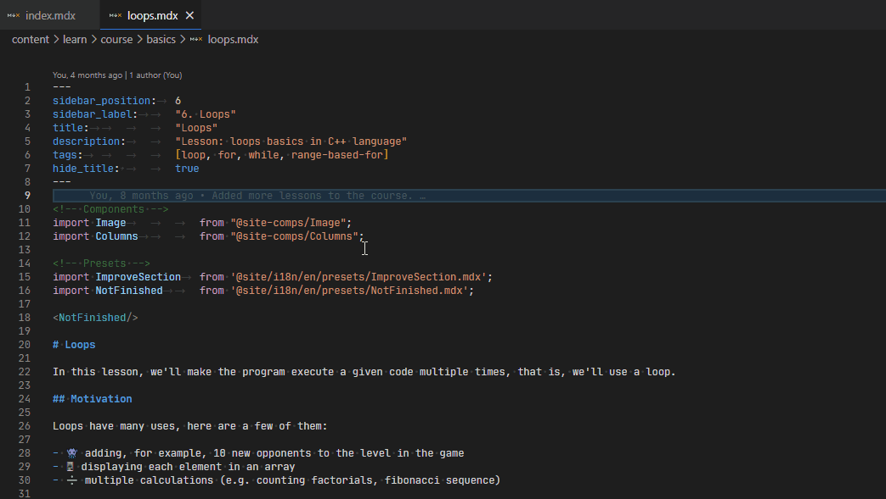

# Docusaurus for VS Code

This extension provides a set of tools to help you manage a Docusaurus project.

## Features

### Better navigation

Automatically detect translation files and quickly jump between them with
a command:

### Launching helpers

See your website in different locales simultaneously (using different ports):

**TODO:** Add image

### Translation helper

See the status of your translation files:

- 🌐 Translations are up to date
- ✍ Translations differ in content amount
- 🚫 Translation document is nearly empty, better to use one in the default locale!

**TODO:** Add image

## Requirements

None.

## Extension Settings

This extension contributes the following settings:

- `docusaurus.rootPathCandidates` - List of paths to search for Docusaurus projects
- `docusaurus.generationFolder` - Path to the folder where generated files are stored
- `docusaurus.i18nFolder` - Path to the folder where translation files are stored

## Known Issues

None yet.

## Release Notes

### 0.1.0

Initial release of the extension.
